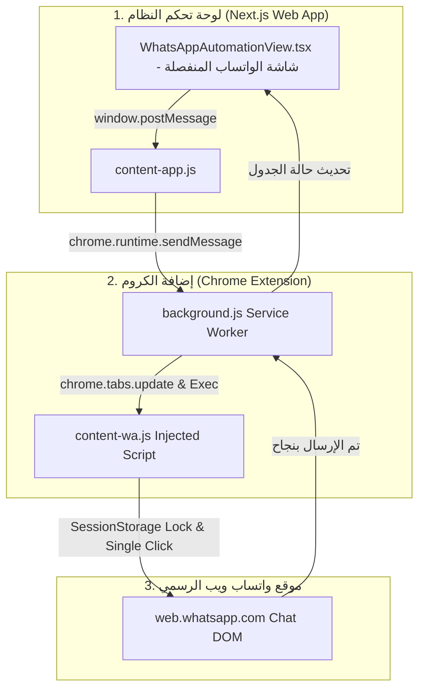

# 📱 الدليل المعماري والشامل لنظام أتمتة الواتساب التلقائي (WhatsApp Automation Architecture)

يقدم هذا المستند تحليلاً هندسياً وشاملاً للفكرة المعمارية التي تم تصميمها وتطبيقها في نظام **CenterFlow** لإرسال نتائج وتقارير الطلاب وأولياء الأمور عبر تطبيق **واتساب ويب (WhatsApp Web)** تلقائياً ومجاناً 100%.

---

## 🎯 1. الهدف والمشكلة البرمجية (The Problem & Goal)

### المشكلة:
* إرسال النتائج والتقارير يدوياً لمئات الطلاب يأخذ ساعات طويلة من المساعدين.
* استخدام خدمات الواتساب الرسمية المدفوعة (WhatsApp Cloud API) يكلف مبالغ مالية متكررة عن كل رسالة.
* تشغيل متصفحات وهمية على السيرفر (مثل `Puppeteer` / `whatsapp-web.js`) يستهلك رامات ضخمة (800MB+) ويحتاج سيرفرات VPS مدفوعة تعمل 24/7، بالإضافة إلى خطورة حظر الرقم إذا تم الإرسال بسرعة.

### الحل المبتكر:
تصميم **إضافة متصفح مخصصة (Chrome Extension V3)** تعمل كـ "جسر أوتوماتيكي ذكي" بين لوحة تحكم النظام (Next.js) وتبويب واتساب ويب المفتوح بالفعل على جهاز المساعد.

---

## 🏗️ 2. الهندسة المعمارية للنظام (System Architecture)

يعتمد النظام على **ثلاثة مكونات رئيسية** تعمل بالتكامل والانسجام:

---

## 🧠 3. شرح الفكرة والآلية التقنية بالتفصيل (Step-by-Step Execution Flow)

### الخطوة 1: بدء الدفعة وتوليد المعرف الفريد (`Batch ID`)
عندما يضغط المساعد على زر **"بدء الإرسال الآلي بواسطة إضافة Chrome 🚀"**:
1. يقوم النظام في Next.js بتوليد كود فريد للدفعة الحالية: `batchId = Date.now().toString()`.
2. يتم تجميع بيانات الطلاب المحددين (الاسم، رقم هاتف ولي الأمر المنسق، نص الرسالة المجهز، و ID الطالب).
3. يتم إرسال حمولة البيانات (Payload) من صفحة النظام إلى إضافة الكروم عبر إشارة `window.postMessage`.

---

### الخطوة 2: استقبال الطابور في خلفية المتصفح (`Service Worker Queue`)
1. يقوم الملف المحقون في تطبيقنا (`content-app.js`) باستلام الإشارة ونقلها إلى خلفية الإضافة (`background.js`).
2. يحفظ `background.js` الرسائل في **طابور إرسال (Sending Queue)** ويبدأ بمعالجة الطالب الأول.
3. يقوم بتشكيل رابط الواتساب المباشر محقوناً بالمعاملات:
   `https://web.whatsapp.com/send?phone=201xxxxxxxxx&text=الرسالة&centerflow_id=ST-1001&centerflow_batch=1755100000`
4. يقوم بتوجيه تبويب الواتساب (`waTabId`) لهذا الرابط في الخلفية بدون الخروج من صفحة النظام.

---

### الخطوة 3: القفل الحديدي لمنع تكرار الرسائل (`Batch SessionStorage Lock`) 🛡️

واحدة من أكبر المشاكل التقنية في أتمتة الواتساب هي **تكرار إرسال الرسالة مرتين لنفس الشخص** بسبب إعادة تحميل الصفحة (Reload) أو تنقلات التطبيقات أحادية الصفحة (SPA Navigations).

#### كيف حلينا هذه المشكلة نهائياً؟
استخدمنا تقنية **`sessionStorage`** الخاصة بالمتصفح، والتي تتميز بأنها **تظل محفوظة ومحمية عبر جميع التنقلات وإعادات التحميل داخل التبويب**:

1. عند فتح رابط الطالب في الواتساب، يقرأ الكود المحقون (`content-wa.js`) الـ `studentId` والـ `batchId` من رابط الصفحة.
2. يقوم بتشكيل مفتاح قفل فريد:
   `storageKey = "cf_sent_" + studentId + "_" + batchId`
3. **التحقق قبل التنفيذ:** يفحص الكود هل المفتاح موجود في الـ `sessionStorage`؟
   - **إذا كان موجوداً:** يتوقف الكود فتراتً في السطر الأول ويمنع الإرسال نهائياً 🛑.
   - **إذا لم يكن موجوداً:** يُسجل القفل فوراً `sessionStorage.setItem(storageKey, "done")` ثم يبدأ بالبحث عن زر الإرسال.

> 💡 **نتيجة هذا القفل:** حتى لو تحمّلت صفحة الواتساب 10 مرات أو استلمت 10 إشارات متداخلة، يقرأ السكريبت القفل المسجل في المرة الأولى ويتجاهل باقي المحاولات تماماً، مما يضمن **خروج الرسالة مرة واحدة فقط لا غير لكل طالب**.

---

### الخطوة 4: المحاكاة والنقر الآمن والمهلة الزمنية (Anti-Ban Delay)
1. يبحث السكريبت المحقون (`content-wa.js`) عن زر الإرسال في هيكل الصفحة (DOM Selectors).
2. عند العثور عليه، يقوم بتنفيذ **نقلة واحدة دقيقة على زر الإرسال** `sendButton.click()`.
3. يُرسل السكريبت إشارة نجاح الإرسال إلى خلفية الإضافة، والتي بدورها تُحدث حالة الجدول في لوحة تحكم Next.js وتظهره ببادج أخضر **(تم الإرسال ✅)** وتوثق الحركة في السجل.
4. **مؤقت حماية الرقم:** تنتظر الإضافة مدة عشوائية مخصصة (مثلاً من 5 إلى 8 ثوانٍ) قبل الانتقال للطالب التالي في القائمة لحماية رقم السنتر من أي حظر تلقائي من واتساب.

---

## 📄 4. متطلبات شاشة الواتساب المنفصلة وقواعد الإرسال (Dedicated WhatsApp Page & Rules)

تم تخصيص **صفحة مستقلة بذاتها في النظام** لأتمتة الواتساب (`WhatsAppAutomationView.tsx`) تتميز بالخصائص وقواعد العمل التالية:

1. **اختيار نوع التقرير (Report Type):**
   * إمكانية الاختيار بين: **تسميع شفوي / درجات كويزات (Recitation)** أو **امتحانات رئيسية (Exams)**.

2. **اختيار المجموعة المستهدفة (Target Group Selection):**
   * قائمة منسدلة تُمكّن المستخدم من تحديد **المجموعة الدراسية (Group)** المراد إرسال تقارير طلابها، أو اختيار جميع المجموعات.

3. **قائمة منسدلة للتسميع/الامتحان المحدد (Assessment Dropdown):**
   * تظهر قائمة منسدلة تفاعلية تحتوي على **التسميعات أو الامتحانات** الخاصة بالمجموعة المختارة، ليقوم المساعد باختيار التسميع المطلوب إرسال تقريره بدقة.

4. **تصفية واستبعاد الطلاب غير المسجل لهم تقييم (Strict Exclude for Missing Grades):**
   * ⚠️ **قاعدة حتمية:** إذا كان الطالب مقيداً بالمجموعة ولكن **لم يُسجّل له درجة أو تقييم** في التسميع/الامتحان المختار، يتم **استبعاده وتجاوزه تلقائياً** ولن يتم إرسال أي تقرير له.

5. **توجيه الرسائل لرقم ولي الأمر (Parent Phone Routing):**
   * يتم استخراج وتنسيق **رقم هاتف ولي الأمر (`parentPhone`)** تلقائياً لكل طالب مستهدف لإرسال التقرير إليه مباشرة.

6. **وضع التجربة الآمن بدون تعديل الداتا بيز (Safe In-Memory Test Mode) 🧪:**
   * زر مخصص لتفعيل وضع التجربة يُوجه كل الرسائل مؤقتاً في ذاكرة الواجهة للرقم `01022372501` دون المساس بقاعدة البيانات الحقيقية للنظام بأي شكل.

---

## 📂 5. تشريح ملفات مجلد الإضافة (`chrome-extension/`)

| اسم الملف | نوعه | الدور التقني الذي يقوم به |
| :--- | :--- | :--- |
| **`manifest.json`** | Configuration | ملف التعريف المعياري للإضافة وفق `Manifest V3` وتحديد صلاحيات الوصول لـ واتساب والنظام. |
| **`content-app.js`** | Content Script | محقون في لوحة تحكم Next.js، يعمل كجسر لنقل أوامر الإرسال وإشارات حالة الإضافة إلى الصفحة. |
| **`background.js`** | Service Worker | يعمل في خلفية المتصفح لإدارة طابور الطلاب (Queue)، التايمر الزمني، والتنقل بين روابط الطلاب. |
| **`content-wa.js`** | Content Script | محقون في موقع `web.whatsapp.com` لتطبيق القفل الحديدي والنقر التلقائي على زر الإرسال مرة واحدة. |
| **`README.md`** | Guide | دليل الاستخدام والتثبيت السريع للمستخدم بالخطوات المباشرة. |

---

## 💎 6. مميزات هذا الحل المعماري

1. **مجاني 100%:** لا مصاريف سيرفرات VPS، ولا اشتراكات في بوابات API.
2. **سيرفر خفيف للغاية:** مشروع Next.js يعمل بسلاسة على Vercel أو الاستضافات المجانية لأن الإرسال يتم بالكامل على كمبيوتر المساعد.
3. **أمان تام ضد الحظر:** الإرسال يتم عبر جلسة واتساب حقيقية بمتصفح المساعد وبمهلة زمنية عشوائية بين الرسائل.
4. **دقة 100% بدقة الإرسال الفردي:** بفضل تقنية القفل المعزول `Batch SessionStorage Lock`.
5. **تصفية ذكية:** استبعاد تلقائي للطلاب الذين ليس لهم تقييم، وتوجيه مباشر لأولياء الأمور.

---

> 📝 **ملاحظة:** تم تحديث هذا المستند المعماري كمرجع شامل ومحدث لمشروع **CenterFlow**.
